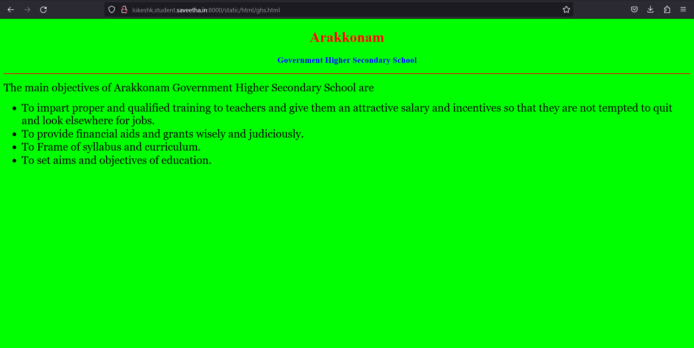
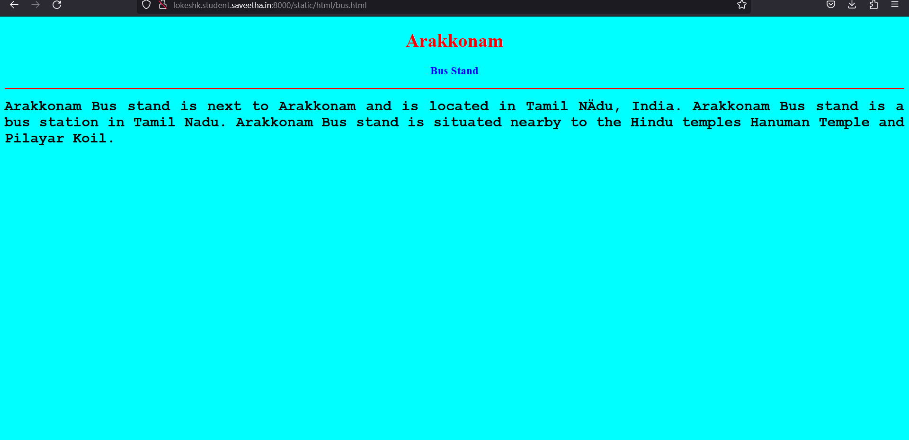

# Places Around Me
## AIM:
To develop a website to display details about the places around my house.

## Design Steps:

### Step 1:
clone the github repositiry into theia IDE.

### Step 2:
create a new django project.

### Step 3:
write the needed HTML code.

### Step 4:
run the django server and execute the HTML files.

## Code:
```
map.html
<!DOCTYPE html>
<html lang="en">
<head>
<title>My City</title>
</head>
<body>
<h1 align="center">
<font color="red"><b>Arakkonam </b></font>
</h1>
<h3 align="center">
<font color="blue"><b>Lokesh k (22002442)</b></font>
</h3>
<center>

<map name="MyCity">
<area shape="circle" coords="190,50,20" href="/static/html/ghs.html" title="Govt. Higher Secondary School">
<area shape="rectangle" coords="230,30,260,60" href="/static/html/atm.html" title="SBI ATM">
<area shape="circle" coords="400,350,50" href="/static/html/ss.html" title="sekar store">
<area shape="circle" coords="400,200,75" href="/static/html/bus.html" title="Bus Stand">
<area shape="rectangle" coords="490,150,870,320" href="/static/html/tmp.html" title="temple">
</map>
</center>
</body>
</html>

bus.html
<!DOCTYPE html>
<html lang="en">
<head>
<title>Bus Stand</title>
</head>
<body bgcolor="cyan">
<h1 align="center">
<font color="red"><b>Arakkonam</b></font>
</h1>
<h3 align="center">
<font color="blue"><b> Bus Stand</b></font>
</h3>
<hr size="3" color="red">
<p align="justify">
<font face="Courier New" size="5">
<b>
Arakkonam Bus stand is next to Arakkonam and is located in Tamil Nādu, India.
Arakkonam Bus stand is a bus station in Tamil Nadu. 
Arakkonam Bus stand is situated nearby to the Hindu temples Hanuman Temple and Pilayar Koil.
</b>
</font>
</p>
</body>
</html>


tmp.html

<!DOCTYPE html>
<html lang="en">
<head>
<title>temple</title>
</head>
<body bgcolor="yellow">
<h1 align="center">
<font color="red"><b>Arakkonam</b></font>
</h1>
<h3 align="center">
<font color="blue"><b>temple</b></font>
</h3>
<hr size="3" color="red">
<p align="justify">
<font face="Tahoma" size="5">
The main deity, Kamakshi, is seated in a majestic Padmasana, an yogic posture signifying peace and prosperity, instead of the traditional standing pose. The goddess holds a sugarcane bow and bunch of flowers in the lower two of her arms and has a pasha (lasso), an ankusha (goad) in her upper two arms. There is also a parrot perched near the flower bunch. There are no other Parvati temples in the city of Kanchipuram, apart from this temple, which is unusual in a traditional city that has hundreds of traditional temples. There are various legends that account for this fact. One of them according to Kamakshivilasa is that the Goddess had to absorb all the other shakthi forms to give a boon to Kama, the Hindu god of love. Another legend attributes it to the Raja Rajeswari pose of the deity that signifies an absolute control over the land under the deity's control.</font>
</p>
</body>
</html>

ss.html

<!DOCTYPE html>
<html lang="en">
<head>
<title>sekar store</title>
</head>
<body bgcolor="pink">
<h1 align="center">
<font color="red"><b>Arakkonam</b></font>
</h1>
<h3 align="center">
<font color="blue"><b>sekar store</b></font>
</h3>
<hr size="3" color="red">
<p align="justify">
<font face="Arial" size="5">
<b>
sekar store in arakkonam is the one of the leading business in the provision stores .
also known  for provisional stores , ,grocery home delivery services ,provision 
wholesaleers and much more. find the address ,contact number.reviews & rating ,
photos , maps, of the sekar store ,arakkonam</b>
</font>
</p>
</body>
</html>


ghs.html

<!DOCTYPE html>
<html lang="en">
<head>
<title>Govt. High. Sec. School</title>
</head>
<body bgcolor="lime">
<h1 align="center">
<font color="red"><b>Arakkonam</b></font>
</h1>
<h3 align="center">
<font color="blue"><b>Government Higher Secondary School</b></font>
</h3>
<hr size="3" color="red">
<p align="justify">
<font face="Georgia" size="5">
The main objectives of Arakkonam  Government Higher Secondary School are 
<ul>
<li>To impart proper and qualified training to teachers and give them an attractive salary and incentives so that they are not tempted to quit and look elsewhere for jobs.</li>
<li>To provide financial aids and grants wisely and judiciously.</li>
<li>To Frame of syllabus and curriculum.</li>
<li>To set aims and objectives of education.</li>
</ul>
</font>
</p>
</body>
</html>

atm.html

<!DOCTYPE html>
<html lang="en">
<head>
<title>SBI ATM</title>
</head>
<body bgcolor="orange">
<h1 align="center">
<font color="red"><b>Arakkonam</b></font>
</h1>
<h3 align="center">
<font color="blue"><b>SBI ATM</b></font>
</h3>
<hr size="3" color="red">
<p align="justify">
<font face="Georgia" size="5">
State Bank of India is an Indian multinational public
 sector bank and financial services statutory body
 headquartered in Mumbai, Maharashtra.ATM 
Access and enhanced convenience .SBI Global International
 Debit Card. Shopping across 30 million outlets
</font>
</p>
</body>
</html>
```

## Output:








## HTML Validator


## Result:
The program for implementing image map is executed successfully.